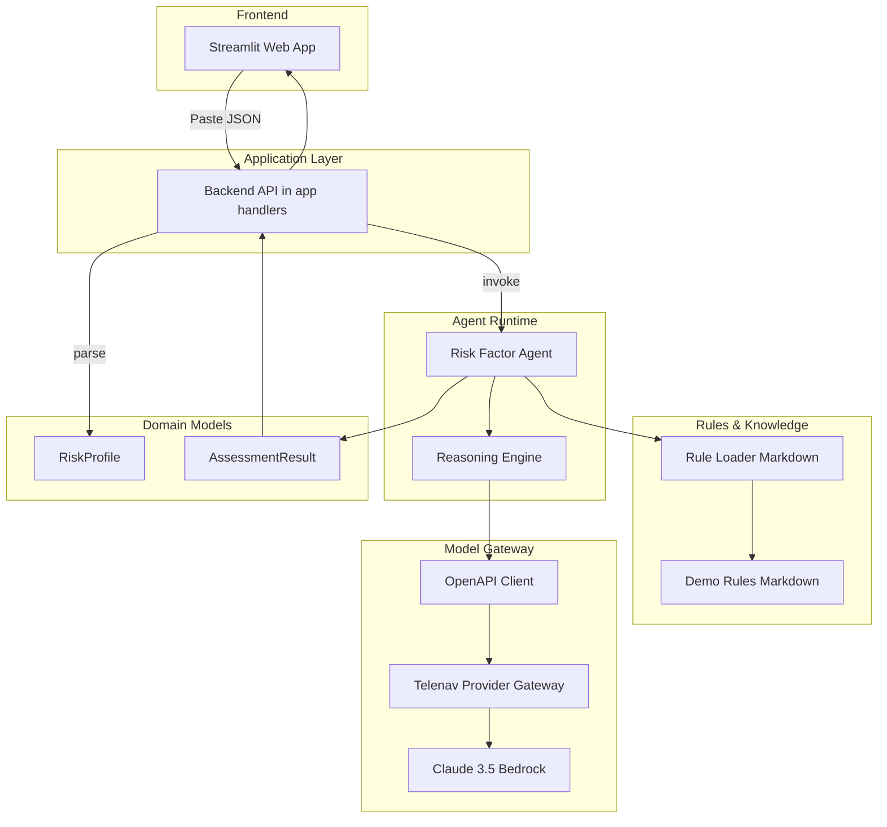
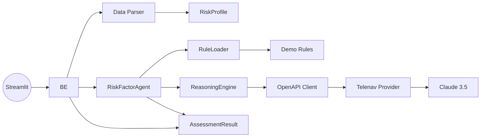
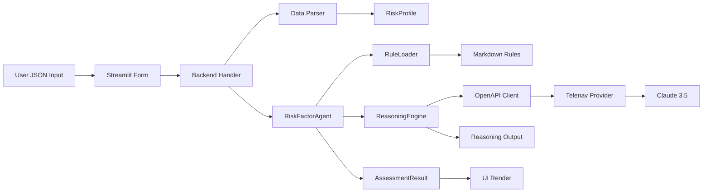
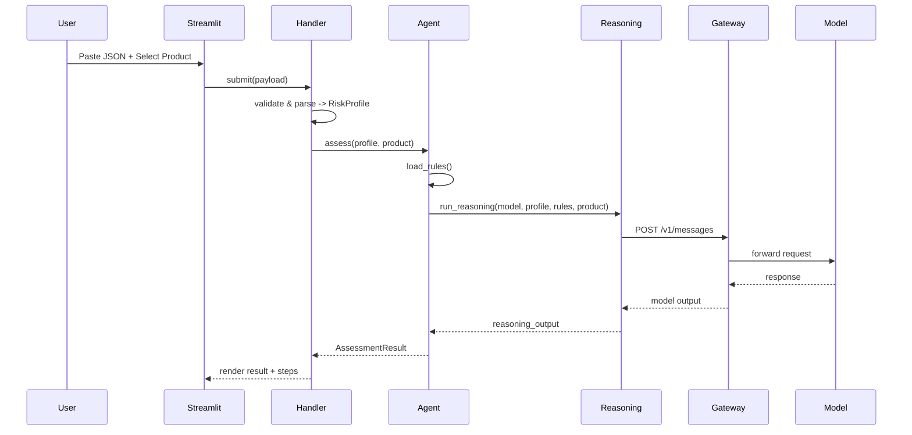

# 保险风险因子推理Agent项目 - 架构设计（6a/2_architect）

## 0. 文档目的与范围
- 基于`ALIGNMENT_insurance_risk_factor_agent.md`与`CONSENSUS_insurance_risk_factor_agent.md`输出系统级设计。
- 产出物覆盖：整体架构图、分层与核心组件、模块依赖关系、接口契约、数据流向、异常处理策略、设计可行性验证与质量门控。
- 严格按本次 Demo 范围设计，避免过度设计；复用既有决策与组件模式。

---

## 1. 整体架构图


---

## 2. 分层设计与核心组件
- 表现层（Presentation/UI）
  - `Streamlit` 前端：提供“粘贴 JSON”的输入框、产品包选择、结果与推理过程可视化。
- 应用层（Application）
  - 轻量 API/Handler：封装数据解析、调用 Agent、格式化结果。
- Agent 运行层（Agent Runtime）
  - `RiskFactorAgent`（协调器）：加载规则、准备提示、调用`ReasoningEngine`、组装`AssessmentResult`。
  - `ReasoningEngine`（推理核心）：构造模型调用请求、组织思维链/步骤、输出可解释轨迹。
- 规则与知识层（Rules & Knowledge）
  - `RuleLoader`：从`docs/.../demo_rules`读取 Markdown，按章节提取条目，暴露可消费的结构。
- 模型与网关（Model Gateway）
  - OpenAPI Client + Telenav Provider：通过网关安全访问 Claude 3.5 (Bedrock)。
- 领域模型层（Domain Models）
  - `RiskProfile`：标准化输入。
  - `AssessmentResult`：评级、要点、明细因子、推理步骤轨迹。

设计原则：
- 与共识/对齐文档一致；仅实现 Demo 所需路径；可扩展但不预先实现复杂费率计算。

---

## 3. 模块依赖关系图


---

## 4. 接口契约定义（Contracts）

### 4.1 环境变量与网关
- 必需环境变量：
  - `TELENAV_API_KEY`：鉴权密钥
  - `TELENAV_BASE_URL`（默认 `https://us-ailab-api.telenav.com/v1/messages`）
  - `MODEL_NAME`（默认 `claude3.5-bedrock`）

- OpenAPI 客户端初始化（参考共识文档）：
```python
model = OpenAIModel(
    client_args={
        "api_key": os.environ["TELENAV_API_KEY"],
        "base_url": os.environ.get("TELENAV_BASE_URL", "https://us-ailab-api.telenav.com/v1/messages"),
    },
    model_name=os.environ.get("MODEL_NAME", "claude3.5-bedrock"),
)
```

### 4.2 数据解析接口（`utils/data_parser.py`）
```python
from typing import Any
from src.models.risk_profile import RiskProfile

def parse_application(raw_json: str) -> RiskProfile:
    """
    Contract:
    - Input: raw_json (str) 与示例结构一致，含 household/drivers/vehicles.
    - Output: RiskProfile 标准化对象；字段缺失需提供安全默认与校验错误集合。
    - Errors: ValueError(格式错误), ValidationError(结构/必填项), returns with issues list.
    """
    ...
```

### 4.3 规则加载接口（`utils/rule_loader.py`）
```python
from typing import List, TypedDict

class RuleDocument(TypedDict):
    id: str
    title: str
    sections: list  # 保留段落/条文的结构化切片
    raw_markdown: str

def load_rules(rules_dir: str) -> List[RuleDocument]:
    """
    Contract:
    - Input: rules_dir 文件夹路径（默认 docs/.../demo_rules）。
    - Output: RuleDocument 列表，保留原始文本与分段，便于提示工程与检索。
    - Errors: FileNotFoundError, IOError.
    """
    ...
```

### 4.4 推理引擎接口（`agents/reasoning_engine.py`）
```python
from typing import Any, Dict, List, TypedDict

class ReasoningStep(TypedDict):
    step: str
    rationale: str
    evidence: List[str]

class ReasoningOutput(TypedDict):
    final_assessment: Dict[str, Any]
    steps: List[ReasoningStep]
    confidence: float

def run_reasoning(model: Any, profile: Any, rules: Any, product_code: str) -> ReasoningOutput:
    """
    Contract:
    - Input: 模型实例, 风险画像, 规则文档集合, 产品包标识。
    - Output: 带有步骤链与信心度的结构化推理输出。
    - Errors: ModelGatewayError, TimeoutError, PromptBuildError.
    """
    ...
```

### 4.5 风险因子 Agent 接口（`agents/risk_factor_agent.py`）
```python
from typing import Any
from src.models.risk_profile import RiskProfile
from src.models.assessment_result import AssessmentResult

def assess(profile: RiskProfile, product_code: str) -> AssessmentResult:
    """
    Contract:
    - Input: RiskProfile, 产品包（Monthly-Economy/Comfort/Turbo）。
    - Behavior: 加载规则 -> 组织提示 -> 调用推理引擎 -> 生成 AssessmentResult。
    - Output: AssessmentResult（含可解释步骤轨迹）。
    - Errors: RuleLoadError, ReasoningError, AssemblyError.
    """
    ...
```

### 4.6 领域模型（`models/`）
```python
from typing import Any, Dict, List, TypedDict

class RiskProfile(TypedDict):
    household: Dict[str, Any]
    drivers: List[Dict[str, Any]]
    vehicles: List[Dict[str, Any]]
    issues: List[str]  # 解析/校验时发现的问题

class AssessmentResult(TypedDict):
    product_code: str
    overall_risk_tier: str  # e.g., LOW/MEDIUM/HIGH
    key_factors: List[str]
    driver_analysis: List[Dict[str, Any]]
    vehicle_analysis: List[Dict[str, Any]]
    policy_analysis: Dict[str, Any]
    reasoning_steps: List[Dict[str, Any]]
    confidence: float
```

---

## 5. 端到端数据流与时序

### 5.1 数据流向图


### 5.2 时序图（简化）


---

## 6. 异常处理策略
- 输入与校验
  - JSON 解析错误：返回易读提示与示例结构链接；不崩溃。
  - 结构校验失败：收集`issues`并在 UI 高亮，允许继续（以降级默认值参与推理）或阻断（严格模式）。
- 规则加载
  - 规则目录不存在/读取失败：抛`RuleLoadError`，UI 友好提示；提供重试与本地缓存（可选）。
- 模型网关
  - 鉴权失败：提示检查`TELENAV_API_KEY`；屏蔽敏感信息。
  - 超时/网络错误：指数退避重试（有限次数），最终降级返回“不可用”并附带离线建议。
- 推理与组装
  - Prompt 构建异常：记录上下文与最小复现场景（不含敏感数据）。
  - 模型输出格式不符：进行健壮解析与兜底（例如严格 JSON 解析失败则回退到提取策略）。
- 观测与日志
  - 统一结构日志：请求 ID、产品包、时延、错误类别、重要因子数量。
  - 可选：将推理步骤按等级脱敏后记录，便于 Demo 回放。

---

## 7. 设计可行性验证
- 符合共识文档技术栈：Streamlit + Strands Agents + OpenAPI + Claude 3.5。
- Demo 仅需读取 Markdown 规则；暂不引入复杂表格费率计算。
- 前后端同仓，简化集成；环境变量提供最小可运行配置。

---

## 8. 质量门控（Checklist）
- 架构图清晰、与实现目录一致。
- 接口定义完整（解析/规则/推理/Agent/模型网关/模型）。
- 与现有文档无冲突；命名与产品包一致。
- 样例输入可跑通端到端，产出`AssessmentResult`并显示推理步骤。
- 异常路径有兜底，错误信息可读、安全。

---

## 9. 与实现目录映射（建议）
```
src/
  agents/
    risk_factor_agent.py
    reasoning_engine.py
  models/
    risk_profile.py
    assessment_result.py
  utils/
    data_parser.py
    rule_loader.py
  streamlit_app.py
```

---

文档状态：拟定（与实现迭代同步更新）


---

## 10. 架构澄清（补充）

### 10.1 Strands Agents 集成边界
- 版本：`strands-agents==1.7.1`（Demo 锁定版本）
- 集成位置：归属于“Agent 运行层（Agent Runtime）”，用于封装推理调用与上下文组织。
- 边界约束（Demo 范围）：
  - 不引入长期记忆/外部工具插件；不做多 Agent 协作编排。
  - 以单一任务流完成：标准化输入 → 规则加载 → 提示构建 → 模型调用 → 结果组装。
  - 仅保留必要的日志/指标；不持久化敏感数据。

### 10.2 模型网关初始化（契约化）
- 通过 Telenav Provider 网关访问 Claude 3.5（Bedrock），HTTP 端点：`https://us-ailab-api.telenav.com/v1/messages`。
- 环境变量：`TELENAV_API_KEY`（必填）、`TELENAV_BASE_URL`（可选，默认如上）、`MODEL_NAME`（默认 `claude3.5-bedrock`）。
```python
import os

model = OpenAIModel(
    client_args={
        "api_key": os.environ["TELENAV_API_KEY"],
        "base_url": os.environ.get("TELENAV_BASE_URL", "https://us-ailab-api.telenav.com/v1/messages"),
    },
    model_name=os.environ.get("MODEL_NAME", "claude3.5-bedrock"),
)
```

### 10.3 Prompt 策略（模板与插槽）
- 目标：引导模型执行多因子关联分析，显式产出结构化评估与可解释步骤链。
- 插槽：
  - `<product_code>`：本次 Demo 固定为 `Monthly-Comfort`。
  - `<profile_json>`：由 `RiskProfile` 序列化的紧凑 JSON（去除空字段）。
  - `<rule_summaries>`：从 RuleLoader 提取的条文摘要（见 10.4）。
  - `<output_schema>`：严格 JSON 输出模式（见下）。
- 模板骨架：
```text
系统：你是汽车保险风控专家，依据业务规则做风险因子推理并输出严格 JSON。
用户：
产品包：<product_code>
用户画像（标准化）：
<profile_json>
可用规则与条文摘要：
<rule_summaries>
任务：
1) 进行多维度风险评估（驾驶员/车辆/保单）。
2) 列出关键因子与应用到的规则证据。
3) 给出清晰的推理步骤链与置信度。
输出：严格遵循下列 JSON Schema，不要输出多余说明。
<output_schema>
```
- 输出模式约束（供模型遵循）：
```json
{
  "final_assessment": {
    "overall_risk_tier": "LOW|MEDIUM|HIGH",
    "key_factors": ["string"]
  },
  "steps": [
    {"step": "string", "rationale": "string", "evidence": ["rule-id-or-quote"]}
  ],
  "confidence": 0.0
}
```

### 10.4 规则解析与加载标准（Demo）
- 加载策略：一次性加载 `docs/insurance_risk_factor_agent/demo_rules` 下所有 Demo 规则；本阶段不使用 RAG 检索。
- 切分标准：按 Markdown 一级/二级标题切分段落；保留项目符号条目与原文摘录，形成 `sections` 结构，便于提示引用。
- 摘要策略：对每段生成一句话摘要（首句/标题行）；保留引用用的短证据片段（≤200 字）。

### 10.5 评估模式：宽松模式（Lenient）
- 行为：当 `parse_application` 发现结构/取值问题时，将问题写入 `issues`，以安全默认值参与推理；UI 侧高亮 `issues`，不中断流程。
- 适用：Demo 默认启用宽松模式；严格模式可后续通过开关引入（阻断推理并提示修正）。

### 10.6 产品包范围（Demo）
- 本次 Demo 仅演示 `Monthly-Comfort`。前后端默认 `product_code = "Monthly-Comfort"`，其他产品包后续扩展。

### 10.7 Demo 环境与版本清单
- 依赖版本建议：
  - `strands-agents==1.7.1`
- 运行所需环境变量（建议在 `.env` 或启动环境中提供）：
```bash
TELENAV_API_KEY=your_key_here
TELENAV_BASE_URL=https://us-ailab-api.telenav.com/v1/messages
MODEL_NAME=claude3.5-bedrock
```

