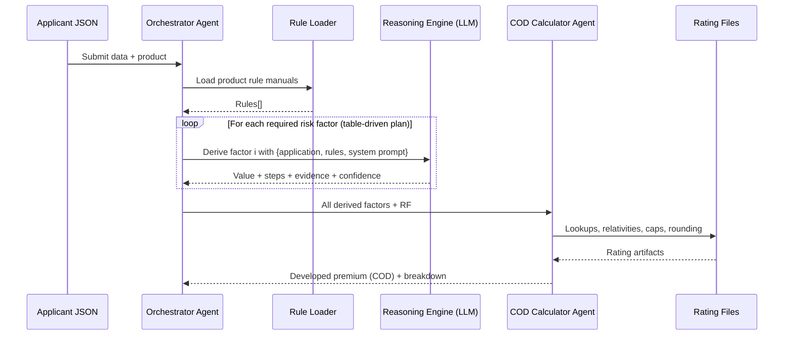
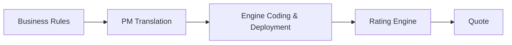

## AI-Driven Risk Factor Quoting — Executive Brief

### Background
This project builds a multi‑agent, low‑code quoting system. AI Agents(virtual employee) assist the quoting process to reach the correct premium result,  with transparent, complex reasoning. Business logic lives in rule manuals (Markdown) and rating files; small glue code is introduced as tools that plug into the AI workflow. The system is designed for easy adjustment to new requirements with zero or minimal code changes.

### What this is
An AI Agent that reads business rules (Markdown), understands an applicant’s JSON, and derives risk factors to compute an insurance quote — with full reasoning trace. It replaces brittle hard-coded rating logic with a table/data-driven approach, cutting change cost and increasing transparency.

### Why it matters (for VP)
- Faster product iteration: update rules/risk-factor specs, not code.
- Explainable decisions: each quote includes a rationale and evidence trail.
- Lower maintenance risk: table-driven orchestration, modular agents.
- Future-ready: plug different models or rating files without re-architecture.

### Why it matters (for investigators/audit)
- Verifiable outputs: strict JSON schema with steps, evidence, confidence.
- Traceability: maps each decision back to named rule sections.
- Safe fallbacks: deterministic pathways when models are unavailable.

### How it works (at a glance)

Single risk factor reasoning (example)
```mermaid
flowchart LR
    A[User Application JSON] --- B[Rule Manual (Markdown)]
    B --- C[System Prompt / Policy]
    A --> D((Reasoning Engine))
    B --> D
    C --> D
    D --> E[Derived Risk Factor Value\n+steps + evidence + confidence]
```

System overview (end-to-end quoting)


### What’s different vs. traditional rules engines
- From code-first to content-first: product managers edit rule docs, not source.
- From opaque pipelines to explainable steps: human-readable reasoning.
- From brittle dependencies to composable skills: add/remove factors per product.

### Proof-of-concept scope
- Frontend: Streamlit demo UI (paste JSON, pick product, run quote).
- Backend: Orchestrator + Reasoning Engine + Quote Calculator.
- Model: Claude 3.5 via provider gateway; safe fallback when unavailable.

### KPIs to watch
- Time-to-rule-change (days → hours)
- Audit acceptance (explainability sufficiency)
- Quote consistency against baseline rating files

### Old vs. New rating engines (at a glance)

Traditional coded rating engine


AI agent factor-assessment engine (low-code)
```mermaid
flowchart LR
   BR2[Rule Manual (Markdown)] --> RL[Rule Loader]
   RF[Rating Files] --> QC[COD Calculator]
   UA[User Application JSON] --> ORCH[Orchestrator]
   RL --> ORCH
   subgraph Agents
     RE[Reasoning Engine]\n(derive factors)
     QC
   end
   ORCH --> RE
   RE --> ORCH
   ORCH --> QC
   QC --> Q2[Quote + Reasoning Trace]
```

### See more
- Consensus & motivation: `CONSENSUS_insurance_risk_factor_agent.md`
- Detailed wiki (flows, diagrams): `PROJECT_WIKI_EN.md`
- ROC overview: `docs/roc/roc.png`

