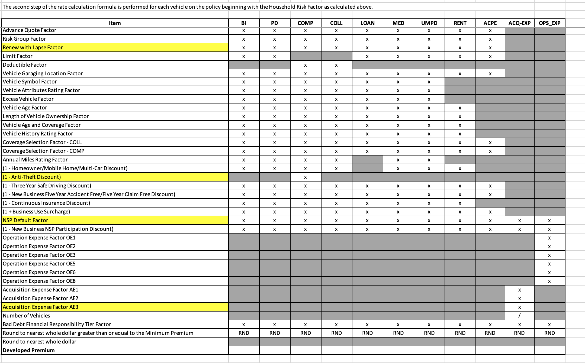
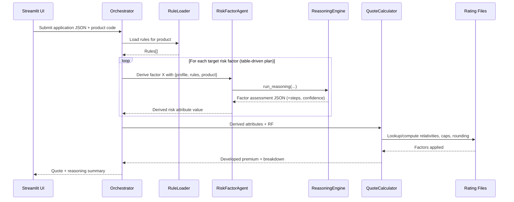

## Insurance Risk Factor Reasoning Agent — Project Wiki (English)

### 1. What is this project?
This demo showcases how an AI Agent performs autonomous reasoning for auto insurance risk factor assessment, contrasting it with traditional hard-coded rules. The Agent reads business rules from Markdown, understands user application data in JSON, performs multi-factor reasoning, and outputs an interpretable assessment.

### 2. Why it matters
- **Autonomous reasoning**: Understands and applies business intent without hard-coded rules
- **Context awareness**: Evaluates cross-factor impacts across drivers, vehicles, and policy history
- **Adaptability**: Handles edge cases and exceptions beyond simple lookups
- **Explainability**: Produces step-by-step reasoning with evidence
- **Lower change cost**: Business rule updates don’t require code changes

### 3. Tech stack and integration
- **Frontend**: Streamlit (Python)
- **Backend**: Strands Agents + Python
- **Gateway**: OpenAPI + Telenav provider gateway
- **Model**: Claude 3.5 via Bedrock
- **Data**: JSON

Configuration example:
```python
import os

model = OpenAIModel(
    client_args={
        "api_key": os.environ["TELENAV_API_KEY"],
        "base_url": os.environ.get(
            "TELENAV_BASE_URL",
            "https://us-ailab-api.telenav.com/v1/messages",
        ),
    },
    model_name=os.environ.get("MODEL_NAME", "claude3.5-bedrock"),
)
```

### 4. Data model (inputs)
The Agent consumes a user application JSON with three layers: household, drivers, and vehicles.

- Household-level example:
```json
{
  "household": {
    "riskAttributeValues": {
      "homeowner": "Y/N",
      "payment-plan": "MONTHLY",
      "prior-carrier": "NOT LISTED",
      "months-of-continuous-insurance": "55",
      "vehicle-count-at-initial-evaluation": "4"
    }
  }
}
```

- Driver-level example:
```json
{
  "drivers": [
    {
      "riskAttributeValues": {
        "date-of-birth": "1970-12-15",
        "driver-age": "55",
        "gender": "F",
        "marital-status": "M",
        "education-level": "2",
        "occupation-code": "AA4",
        "years-licensed": "3",
        "disclosed-violations": "..."
      }
    }
  ]
}
```

- Vehicle-level example:
```json
{
  "vehicles": [
    {
      "riskAttributeValues": {
        "model-year": "2017",
        "make": "VL",
        "model": "V6",
        "annual-miles": "13999",
        "safety-score": "201",
        "theft-indicator": "N",
        "coll-deductible": "1500"
      }
    }
  ]
}
```

### 5. Key risk factors
- **Driver**: age, gender, marital status, education, driving experience, violations
- **Vehicle**: year, make/model, safety score, annual mileage, theft indicator, deductible
- **Policy**: homeowner flag, payment plan, prior carrier, continuous insurance duration

### 6. Core capabilities
1. Intelligent data understanding of JSON inputs
2. Rule comprehension from Markdown under `docs/insurance_risk_factor_agent/demo_rules`
3. Multi-dimensional factor reasoning and cross-factor interactions
4. Adaptive decisions under edge/exception scenarios
5. Explainable outputs with rationale and evidence
6. Dynamic adjustment by product package

### 7. Reasoning workflow
```
User JSON input → Data parsing → Load rule knowledge →
Multi-factor risk analysis → Factor interaction reasoning → Business logic validation →
Edge case handling → Generate assessment → Show detailed reasoning steps
```

### 8. Explainability
- Step-by-step reasoning trail for each decision point
- Display factor weights or salience (when available)
- Document which rules were applied and why
- Clarify boundary-condition handling
- Provide decision basis and confidence (qualitative)

### 9. Autonomy boundary
- Fully autonomous reasoning for end-to-end assessment
- Self-explanation of complex scenarios
- Self-handling of data anomalies and boundary cases
- Self-generation of assessment report and recommendations

### 10. Demo scenarios (product packages)
- Monthly-Economy (baseline)
- Monthly-Comfort (enhanced)
- Monthly-Turbo (advanced)

### 11. Project structure
```
demo-risk-factor-agent/
├── docs/
│   └── insurance_risk_factor_agent/
│       ├── ALIGNMENT_insurance_risk_factor_agent.md
│       ├── CONSENSUS_insurance_risk_factor_agent.md
│       ├── demo_application/
│       │   └── user_application.json
│       └── demo_rules/
│           ├── P20_Financial_Responsibility.md
│           └── P22_Financial_Responsibility_Tier.md
├── src/
│   ├── agents/
│   │   ├── risk_factor_agent.py
│   │   └── reasoning_engine.py
│   ├── models/
│   │   ├── risk_profile.py
│   │   └── assessment_result.py
│   ├── utils/
│   │   ├── data_parser.py
│   │   └── rule_loader.py
│   └── streamlit_app.py
├── requirements.txt
└── README.md
```

### 12. Implementation plan (high level)
- Phase 1 — Foundations: project setup, env, demo rules, data parser
- Phase 2 — Core: agent logic, reasoning engine, model integration, rule parsing
- Phase 3 — UI: Streamlit input, results view, reasoning visualization
- Phase 4 — Tests/Polish: sample-driven tests, UX improvements, docs

### 13. Acceptance criteria
- Parses `user_application.json`-like inputs
- Reads and understands rule Markdown
- Produces accurate, business-meaningful risk assessments
- Displays a clear reasoning trace
- Streamlit UI is usable and clear

### 14. Risks and assumptions
- Risks: API stability, model reasoning accuracy, data format compatibility
- Assumptions: demo rules are representative; Claude 3.5 understands domain logic; JSON structure remains stable

### 15. Success metrics
1. Functional completeness of core features
2. Reasoning fidelity to business logic
3. Usability of UI
4. Clarity in demonstrating AI Agent advantages over hard-coded rules
5. Code quality and maintainability

### 16. Getting started
- Prerequisites: Python 3.11+, `pip`
- Environment variables:
  - `TELENAV_API_KEY` (required)
  - `TELENAV_BASE_URL` (optional, default: `https://us-ailab-api.telenav.com/v1/messages`)
  - `MODEL_NAME` (optional, default: `claude3.5-bedrock`)
- Install dependencies:
```bash
pip install -r requirements.txt
```
- Run the Streamlit app:
```bash
streamlit run src/streamlit_app.py
```
- Try the demo:
  - Open the app in your browser
  - Paste a JSON similar to `docs/insurance_risk_factor_agent/demo_application/user_application.json`
  - Select a product package (Economy/Comfort/Turbo)
  - Run the assessment to view the result and reasoning trace

### 17. Where to find things
- Rules: `docs/insurance_risk_factor_agent/demo_rules/`
- Sample application data: `docs/insurance_risk_factor_agent/demo_application/`
- Agent and reasoning: `src/agents/`
- Data parsing and rule loading: `src/utils/`
- Data models: `src/models/`
- UI: `src/streamlit_app.py`

### 18. Out of scope for the demo
- Strict performance/SLO guarantees
- Production-grade security and governance
- Pricing/actuarial calibration beyond demonstration purposes


### 19. AI-driven quoting — Motivation and ROC
- See the motivation and agreed scope in `docs/insurance_risk_factor_agent/CONSENSUS_insurance_risk_factor_agent.md`.
- Essence of a quoting engine: determine the developed premium from a sequence of risk factors based on three inputs: the user's application, PM-defined rules, and rating files.
- We adopt a table-driven reasoning style: for each derived risk attribute, enumerate its required base risk attribute values, then reason deterministically/semantically to derive the target attribute. Many reasoning routes are prepared offline in a data-driven way, so the online Agent can focus on higher-order judgment.

ROC (reasoning/operation/control) view:




### 20. Why AI-driven quoting
- **Faster rule evolution**: swapping or extending rule Markdown does not require code changes; just provide new risk-factor definitions and, if needed, updated rating files.
- **Semantic flexibility**: LLM can reconcile messy inputs and edge cases while still emitting a structured, verifiable output schema.
- **Explainability-by-design**: each decision emits rationale and evidence, enabling audits and PM sign-off.
- **Composable architecture**: risk-factor skills can be added/removed per product without touching the core orchestrator.


### 21. How an LLM derives a risk attribute (flowchart)
This mirrors `src/agents/reasoning_engine.py` and shows how a single risk attribute (or a focused assessment) is produced from profile + rules + product code.

```mermaid
flowchart TD
    A[run_reasoning(agent?, risk_factor, profile, rules, product_code)] --> B{Agent available?}
    B -- no / ModelGatewayError --> Fallback[_fallback_reasoning on counts] --> R[Return fallback JSON]
    B -- yes --> C[Build prompt via _build_prompt\n- Output JSON schema\n- Standardized profile JSON\n- Rule summaries (top N)\n- check_the_risk_attribute_subject]
    C --> D[Call agent(prompt)]
    D --> E{Parse JSON}
    E -- direct json.loads ok --> N[Normalize fields\n- steps[] default\n- confidence default\n- final_assessment defaults]
    E -- parse error --> G[Regex extract first { ... } block] --> H[json.loads]
    H --> N
    N --> L[Log metrics: elapsed_ms, tier, steps]
    L --> Q[Return normalized JSON]
    D -. exception .-> ERR[Log error] --> Fallback
```

Key outputs (schema excerpt):

```json
{
  "final_assessment": {
    "three_year_claim_free_discount": "Yes|No",
    "key_factors": ["..."]
  },
  "steps": [{"step": "...", "rationale": "...", "evidence": ["rule-id"]}],
  "confidence": 0.0
}
```


### 22. System orchestration and quote calculation
We use a coordinator (orchestrator) to manage risk-factor reasoning and to compute the final premium when the set is complete.

- The orchestrator selects which risk factors to derive for a product, loads relevant rules, invokes the reasoning Agent per factor, and aggregates results (with partial failures tolerated using safe defaults or fallbacks).
- When aggregation meets completeness criteria, it invokes a `quote-calculator` Agent to combine derived attributes with rating files to compute the premium.

Reference architecture (sequence):



Implementation notes:
- Risk-factor plan is table/data-driven, enabling easy addition/removal per product.
- Each factor can specify its required base attributes; unresolved prerequisites are either derived first or defaulted.
- Partial failures are surfaced with confidence levels and do not block quoting unless gated by policy.

