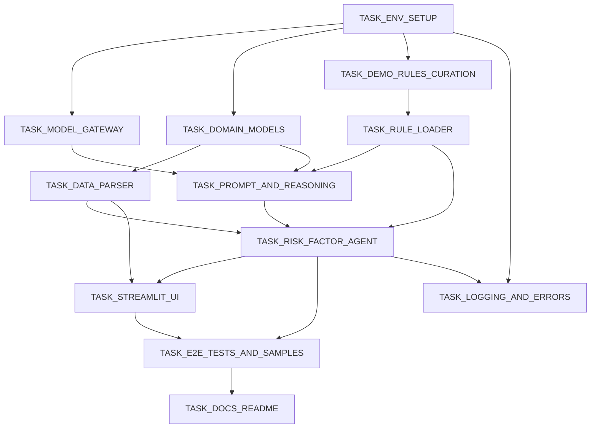

# 任务总览（6a/3_atomize）

## 目标
- 基于 `DESIGN_insurance_risk_factor_agent.md` 与 `CONSENSUS_insurance_risk_factor_agent.md`，将实现拆分为可独立验证的原子任务。
- 每个任务包含：输入/输出契约、实现约束、依赖关系、验收标准。

## 任务清单
- TASK_ENV_SETUP
- TASK_DOMAIN_MODELS
- TASK_MODEL_GATEWAY
- TASK_DEMO_RULES_CURATION
- TASK_DATA_PARSER
- TASK_RULE_LOADER
- TASK_PROMPT_AND_REASONING
- TASK_RISK_FACTOR_AGENT
- TASK_STREAMLIT_UI
- TASK_E2E_TESTS_AND_SAMPLES
- TASK_LOGGING_AND_ERRORS
- TASK_DOCS_README

### 验收记录链接（6a/5_automate）
- [TASK_ENV_SETUP 验收记录](TASK_ENV_SETUP/ACCEPTANCE_TASK_ENV_SETUP.md)
- [TASK_DOMAIN_MODELS 验收记录](TASK_DOMAIN_MODELS/ACCEPTANCE_TASK_DOMAIN_MODELS.md)
- [TASK_MODEL_GATEWAY 验收记录](TASK_MODEL_GATEWAY/ACCEPTANCE_TASK_MODEL_GATEWAY.md)
- [TASK_DEMO_RULES_CURATION 验收记录](TASK_DEMO_RULES_CURATION/ACCEPTANCE_TASK_DEMO_RULES_CURATION.md)
- [TASK_DATA_PARSER 验收记录](TASK_DATA_PARSER/ACCEPTANCE_TASK_DATA_PARSER.md)
- [TASK_RULE_LOADER 验收记录](TASK_RULE_LOADER/ACCEPTANCE_TASK_RULE_LOADER.md)
- [TASK_PROMPT_AND_REASONING 验收记录](TASK_PROMPT_AND_REASONING/ACCEPTANCE_TASK_PROMPT_AND_REASONING.md)
- [TASK_RISK_FACTOR_AGENT 验收记录](TASK_RISK_FACTOR_AGENT/ACCEPTANCE_TASK_RISK_FACTOR_AGENT.md)
- [TASK_STREAMLIT_UI 验收记录](TASK_STREAMLIT_UI/ACCEPTANCE_TASK_STREAMLIT_UI.md)
- [TASK_E2E_TESTS_AND_SAMPLES 验收记录](TASK_E2E_TESTS_AND_SAMPLES/ACCEPTANCE_TASK_E2E_TESTS_AND_SAMPLES.md)
- [TASK_LOGGING_AND_ERRORS 验收记录](TASK_LOGGING_AND_ERRORS/ACCEPTANCE_TASK_LOGGING_AND_ERRORS.md)
- [TASK_DOCS_README 验收记录](TASK_DOCS_README/ACCEPTANCE_TASK_DOCS_README.md)

## 依赖图

## 质量门控
- 覆盖完整需求、依赖无循环、独立可验收、复杂度适中。

## 质量标准（6a/4_approve）
- 完整性：任务集合覆盖设计文档的解析/规则/推理/Agent/UI/网关/日志/文档与 E2E。
- 一致性：命名与 `DESIGN` 接口契约一致；产品包默认 `Monthly-Comfort`。
- 可行性：技术栈与网关配置已在设计第10章明确；每任务可独立推进。
- 可控性：按依赖图推进，风险集中在模型网关与推理解析，已有兜底策略。
- 可测性：每任务含验收标准；E2E 任务提供样例与流程。

## 最终确认清单
- 明确的实现需求：各任务内“输出契约”无歧义。
- 明确的子任务定义：任务粒度可执行，依赖清晰。
- 明确的边界与限制：Demo 范围、宽松模式、仅 `Monthly-Comfort` 已标注。
- 明确的验收标准：每任务均给出。
- 代码/测试/文档质量标准：见各任务“实现约束”与本文件“质量标准”。
